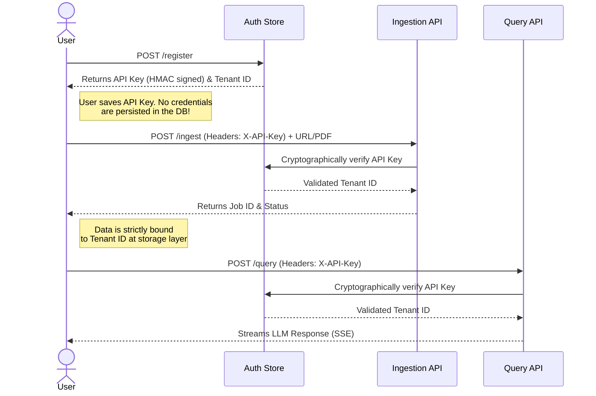
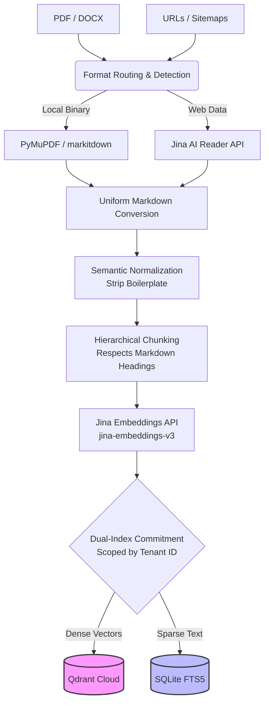
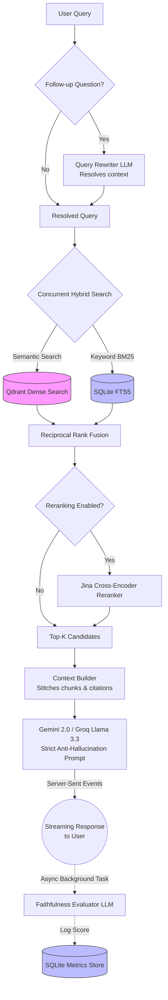
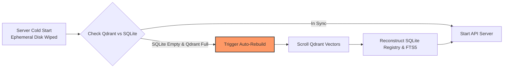

# Nexus RAG

An advanced, highly performant Retrieval-Augmented Generation (RAG) system engineered as an in-memory microservice. Designed for extreme accuracy, strict hallucination prevention, and absolute corpus independence.

**Live Deployment:**
- 🖥️ **API Backend** (Render Free Tier): `https://nexus-rag-backend-hjxa.onrender.com/docs/`
- 💬 **Streamlit UI** (Streamlit Cloud): `https://nexus-rag-2026.streamlit.app`

## Architecture Vision
The system ingests heterogeneous data formats and transforms them into an intelligent, vector-searchable knowledge base. It adheres strictly to in-memory processing patterns—avoiding slow intermediate disk writes—while maintaining comprehensive pipeline observability and strict multi-tenant security isolation. Built for the cloud, it gracefully handles complex, stateful human conversations at scale.

## Local Quickstart

**1. Prerequisites & Tech Stack**
- **Language**: Python 3.10+
- **Frameworks**: FastAPI, Streamlit
- **Databases**: Qdrant Cloud (Dense), SQLite FTS5 (Sparse & Registry)
- **APIs**: Groq / Gemini (Generation), Jina AI (Embeddings & Reranking)

**2. Environment Setup**
Create a `.env` file in the root directory and populate it with your API keys:
```env
# Required API Keys
GEMINI_API_KEY="your_gemini_key"
GROQ_API_KEY="your_groq_key"
JINA_API_KEY="your_jina_key"

# Qdrant Vector Database
QDRANT_URL="your_qdrant_cluster_url"
QDRANT_API_KEY="your_qdrant_api_key"
QDRANT_COLLECTION_NAME="nexus_rag_collection"

# Security (HMAC Signing Seed)
RAG_API_KEY="your-super-secret-admin-key"

# Optional Toggles
INGESTION_CONCURRENCY=2
ENABLE_QUERY_GENERALISATION=false
ENABLE_RERANKER=false
```

**3. Run the Backend (FastAPI)**
```bash
git clone https://github.com/rudrabaru/nexus-rag.git
cd nexus-rag
python -m venv venv
# Windows: venv\Scripts\activate
# Mac/Linux: source venv/bin/activate
pip install -r requirements.txt
uvicorn src.api.main:app --reload
```
*The API will be available at `http://localhost:8000/docs`*

**4. Run the Frontend (Streamlit)**
In a new terminal window, activate the virtual environment and run:
```bash
streamlit run ui/app.py
```
*The UI will automatically open in your default browser.*

## Features

### Intelligent Data Ingestion
- **Multi-Format Extraction:** Seamlessly processes URLs, PDFs, DOCX, MD, and TXT files.
- **Multimodal Vision:** Optional OCR and visual analysis intercepts images and scanned documents, converting visual data into searchable text.
- **Dynamic Web & Sitemap Crawling:** Employs intelligent external web reading services for lightweight, serverless web and sitemap scraping without heavy local headless browsers. Supports selective XML sitemap URL prefix filtering for targeted subsection indexing.

### Semantic Normalization & Chunking
- **Boilerplate Detection:** Uses statistical corpus frequency analysis to automatically detect and strip navigation menus, footers, and noise. For single-document ingestions, gracefully falls back to structural signals (link density, word count, edge position) when corpus statistics aren't available.
- **Hierarchical Chunking:** Preserves semantic meaning by chunking documents based on their underlying structural hierarchy (headings, paragraphs) rather than arbitrary token counts. 
- **Block Atomicity:** Enforces strict contiguous boundaries for code blocks, tables, and images, guaranteeing that complex structures are never split during processing.

### Advanced Retrieval Engine
- **Hybrid Search:** Combines semantic dense vector search with a dynamic sparse keyword index to capture both conceptual intent and exact terminology.
- **Reciprocal Rank Fusion (RRF):** Fuses the results of both search paradigms mathematically for optimal recall.
- **Cross-Encoder Reranking (Optional):** Applies a high-fidelity cross-encoder model to surface the most contextually relevant chunks from the fused candidate pool. Exposed as a runtime toggle — empirical ablation on our benchmark showed the off-the-shelf reranker reduces Recall@1 (0.974 → 0.816), so it is recommended only for latency-tolerant, non-interactive workloads where deeper cross-attention is more valuable than pinpoint top-1 precision.
- **Multi-Tenancy & Isolation:** Deep integration of Tenant ID and Visibility scopes at the database layer ensures private workspace data is cryptographically isolated and invisible to unauthorized queries.

### Conversational Memory & Generation
- **Stateful Query Rewriting:** Intercepts human follow-up questions and automatically rewrites them into fully resolved search queries based on the conversation history.
- **Strict Anti-Hallucination Constraints:** Employs aggressive prompt engineering to force the generative model to answer *only* from the provided context.
- **Explicit Citation Tracking:** Every factual claim generated is explicitly cited and mapped back to the specific source document and section heading.
- **Real-Time Streaming:** Streams tokens back to the client via Server-Sent Events (SSE) for a near-zero latency UX.

### Observability & Automated Evaluation
- **Pipeline Telemetry:** Built-in observability logs discrete timing for every micro-stage (embedding, search, reranking, generation) to pinpoint latency bottlenecks.
- **LLM-as-a-Judge Evaluation:** Features an automated evaluation framework that synthesizes evaluation datasets directly from your corpus, grading the pipeline on retrieval recall and generation faithfulness.
- **Retrieval Benchmarking & Ablation Suite:** A standalone evaluation engine enabling isolated scientific ablation studies across semantic-only, keyword-only, hybrid rank-fused, and reranked retrieval modes. Measures precision, recall, mean reciprocal rank, and full latency distributions (including median and tail latencies), alongside automated failure analysis for reranking regressions. Every evaluation run generates a cryptographic reproducibility fingerprint to guarantee auditability under strict tenant security boundaries.

## Pipeline Architecture

Detailed architectural and implementation documentation for each phase of the pipeline can be found in the `docs/phases/` directory. These documents explain the core logic and design philosophy behind the system.

1. [Phase 1: Ingestion](docs/phases/phase1_ingestion.md) - Multi-format data extraction and normalization.
2. [Phase 2: Processing](docs/phases/phase2_processing.md) - Boilerplate cleaning, noise removal, and structural validation.
3. [Phase 3: Chunking](docs/phases/phase3_chunking.md) - Hierarchical semantic splitting and block atomicity.
4. [Phase 4: Embedding](docs/phases/phase4_embedding.md) - Dense and sparse vector generation.
5. [Phase 5: Retrieval](docs/phases/phase5_retrieval.md) - RRF Fusion and Cross-Encoder reranking.
6. [Phase 6: Evaluation](docs/phases/phase6_evaluation.md) - Automated LLM-as-a-judge benchmarking.
7. [Phase 7: Generation](docs/phases/phase7_generation.md) - Strict anti-hallucination prompt engineering and citation.
8. [Phase 8: Conversational RAG](docs/phases/phase8_conversational_rag.md) - Stateful query rewriting and memory management.
9. [Phase 9: Production Tradeoffs](docs/phases/phase9_production_tradeoffs.md) - Architectural design decisions and tradeoffs.

## The User Workflow (How to use Nexus RAG)

This flow illustrates the strict multi-tenant isolation and stateless authentication process a user goes through to interact with their private workspace.



## The Ingestion Pipeline (Internal Flow)

This flowchart visualizes how heterogeneous data is processed, chunked, and dual-indexed into Qdrant and SQLite without losing its structural hierarchy.



## The Query Pipeline (Internal Flow)

This flowchart visualizes the highly orchestrated, multi-stage hybrid retrieval and generation process.



## Cloud Deployment Resilience (Auto-Recovery Flow)

This shows how the system survives Render's ephemeral disk wipes by treating Qdrant as the durable source of truth.




## Deployment & Production Notes

NexusRAG is designed to be deployed as a containerized microservice. It is optimized to run efficiently even on resource-constrained cloud infrastructure by offloading heavy ML computation (embeddings and generation) to specialized external APIs, maintaining a near-zero memory footprint for AI models.

**Storage & Auto-Rehydration:**
The system is entirely stateless. For production deployments, cloud vector storage handles persistent vector and payload persistence. Whenever a container restarts or spins up after being idle, an automated initialization routine connects to the cloud vector store and rehydrates the local full-text search index and document registries in memory within seconds. Furthermore, tenant authentication is handled via **stateless HMAC-signed API keys**. User credentials and workspace access remain fully valid across server restarts without requiring any persistent relational database or disk storage. This guarantees zero data loss and persistent multi-tenant isolation without requiring paid persistent disks, provided the cloud database connection credentials are securely configured in the environment.

**Workspace Access:**
Users create a private workspace by clicking **"Generate New API Key"** in the Streamlit UI sidebar. No email, password, or registration secret is required. The generated key acts as both identity and credential — copy and save it. On future visits, paste the key into the **"Existing API Key"** field to instantly restore your workspace and all previously uploaded documents. Keys are cryptographically self-verifying and survive server restarts, so a key generated today will remain valid indefinitely as long as the backend's `RAG_API_KEY` environment secret is unchanged.
