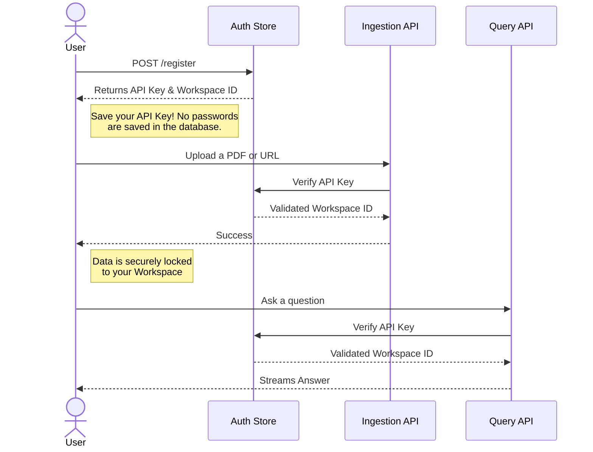
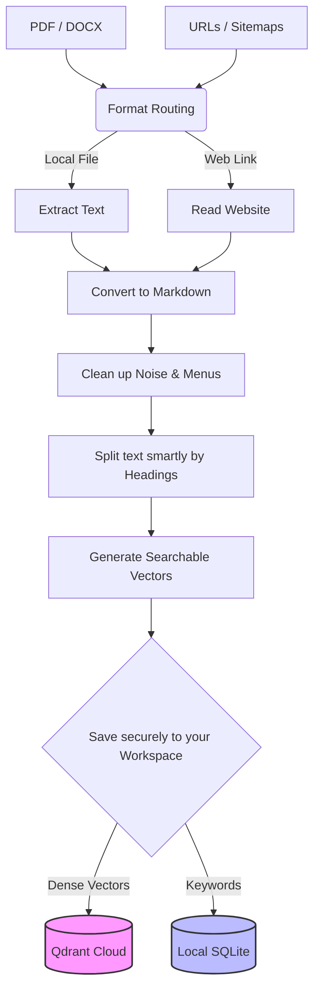
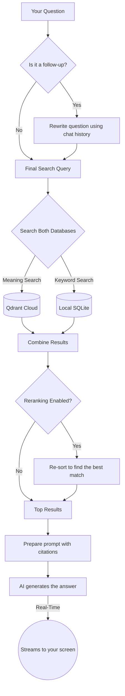
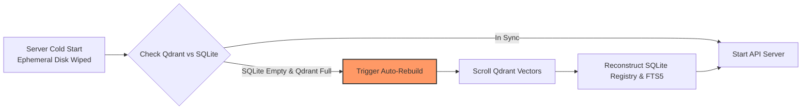

# Nexus RAG

A fast, accurate, and secure Retrieval-Augmented Generation (RAG) system. It reads your documents, understands the context, and answers questions reliably without making things up.

**Live Deployment:**
- 🖥️ **API Backend** (Render Free Tier): `https://nexus-rag-backend-hjxa.onrender.com/docs/`
- 💬 **Streamlit UI** (Streamlit Cloud): `https://nexus-rag-2026.streamlit.app`

## Overview
Nexus RAG takes your files (PDFs, URLs, text) and turns them into a searchable knowledge base. It's designed to be fast by processing data in memory, secure by keeping user workspaces completely separated, and smart enough to handle complex follow-up questions just like a real conversation.

## Local Quickstart

**1. Prerequisites & Tech Stack**
- **Language**: Python 3.10+
- **Frameworks**: FastAPI, Streamlit
- **Databases**: Qdrant Cloud (Cloud Vector DB), SQLite (Local Keyword Search)
- **APIs**: Groq / Gemini (Text Generation), Jina AI (Embeddings & Reranking)

**2. Environment Setup**
Create a `.env` file in the root directory and populate it with your API keys:
```env
# Required API Keys
GEMINI_API_KEY="your_gemini_key"
GROQ_API_KEY="your_groq_key"
JINA_API_KEY="your_jina_key"

# Qdrant Vector Database
QDRANT_URL="your_qdrant_cluster_url"
QDRANT_API_KEY="your_qdrant_api_key"
QDRANT_COLLECTION_NAME="nexus_rag_collection"

# Security (Master Password)
RAG_API_KEY="your-super-secret-admin-key"

# Optional Settings
INGESTION_CONCURRENCY=2
ENABLE_QUERY_GENERALISATION=false
ENABLE_RERANKER=false
```

**3. Run the Backend (FastAPI)**
```bash
git clone https://github.com/rudrabaru/nexus-rag.git
cd nexus-rag
python -m venv venv
# Windows: venv\Scripts\activate
# Mac/Linux: source venv/bin/activate
pip install -r requirements.txt
uvicorn src.api.main:app --reload
```
*The API will be available at `http://localhost:8000/docs`*

**4. Run the Frontend (Streamlit)**
In a new terminal window, activate the virtual environment and run:
```bash
streamlit run scripts/chat_ui.py
```
*The UI will automatically open in your default browser.*

## Key Features

### Document Processing
- **Reads Multiple Formats:** Easily processes website URLs, PDFs, DOCX, Markdown, and TXT files.
- **Image Reading:** Built-in OCR (Optical Character Recognition) can extract and read text directly from images and scanned documents.
- **Web Crawling:** You can drop in a URL or an XML Sitemap, and the system will automatically crawl and read the website for you.

### Text Splitting
- **Noise Removal:** Automatically detects and removes useless website menus, footers, and legal boilerplate so the AI focuses only on the real content.
- **Smart Chunking:** Instead of blindly chopping text every 500 words, it respects your document's natural structure (headings, paragraphs, code blocks, and tables) so no context is ever lost.

### Search Engine
- **Hybrid Search:** Combines meaning-based search (Dense Vectors) with exact keyword matching (Sparse Text) so it never misses a relevant detail.
- **Reranking:** Re-evaluates search results on the fly to ensure the most useful information is placed at the very top. Exposed as a runtime toggle — empirical ablation on our benchmark showed the off-the-shelf reranker reduces Recall@1 (0.974 → 0.816), so it is recommended only for latency-tolerant, non-interactive workloads where deeper cross-attention is more valuable than pinpoint top-1 precision.
- **Private Workspaces:** Your uploaded documents and chat history are cryptographically locked to your API key. No one else can query or see your data.

### Chat & Memory
- **Follow-up Questions:** Remembers the context of your conversation so you can ask natural follow-up questions without repeating yourself.
- **No Hallucinations:** The AI is strictly programmed to answer *only* using the documents you provided. If the answer isn't in the text, it will tell you.
- **Clear Citations:** Every answer includes exact citations so you can verify where the AI found the information.
- **Real-Time Streaming:** Responses stream onto your screen instantly, just like ChatGPT.

### Testing & Monitoring
- **Performance Tracking:** Built-in logs track exactly how long each step (searching, ranking, generating) takes.
- **Automated Grading:** The system can automatically grade itself on how well it retrieved information and how accurate its final answers are.

## Pipeline Architecture

For deep-dive documentation on how each step works under the hood, check out the `docs/phases/` directory:

1. [Phase 1: Ingestion](docs/phases/phase1_ingestion.md) - Reading and extracting data.
2. [Phase 2: Processing](docs/phases/phase2_processing.md) - Cleaning out noise.
3. [Phase 3: Chunking](docs/phases/phase3_chunking.md) - Splitting text smartly.
4. [Phase 4: Embedding](docs/phases/phase4_embedding.md) - Converting text to searchable numbers.
5. [Phase 5: Retrieval](docs/phases/phase5_retrieval.md) - Finding the best answers.
6. [Phase 6: Evaluation](docs/phases/phase6_evaluation.md) - Grading the system's accuracy.
7. [Phase 7: Generation](docs/phases/phase7_generation.md) - Writing the final response.
8. [Phase 8: Conversational RAG](docs/phases/phase8_conversational_rag.md) - Handling chat memory.
9. [Phase 9: Production Tradeoffs](docs/phases/phase9_production_tradeoffs.md) - Why we built it this way.

## The User Workflow (How to use Nexus RAG)

This flow illustrates how your private workspace is kept secure.



## The Ingestion Pipeline (Internal Flow)

This flowchart visualizes how your files are processed and saved.



## The Query Pipeline (Internal Flow)

This flowchart visualizes how the system finds the perfect answer.



## Cloud Deployment Resilience (Auto-Recovery Flow)

This shows how the system survives Render's ephemeral disk wipes by treating Qdrant as the durable source of truth.




## Setup & Hosting Notes

Nexus RAG is incredibly easy to host in the cloud with RAM constraints because it doesn't rely on massive local databases. 

**Storage & Recovery:**
The system stores all the heavy, searchable data securely in **Qdrant Cloud**. If your server ever restarts or crashes, it takes just a few seconds to automatically reconnect to Qdrant and restore your entire search index back into memory. This means you never lose data and don't have to pay for expensive, persistent hard drives on your hosting provider.

**Workspace Access:**
You don't need to sign up with an email or password. Simply click **"Generate New API Key"** in the sidebar of the chat interface. This unique key acts as your private workspace lock. Save this key somewhere safe! The next time you visit, paste that exact key into the **"Existing API Key"** box to instantly unlock your workspace, your chat history, and all the documents you previously uploaded.
